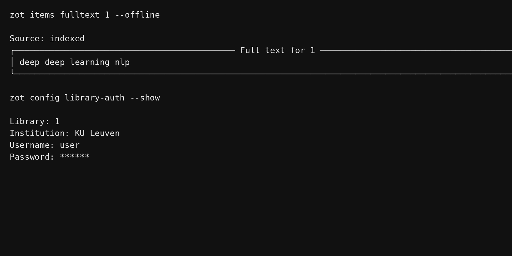

# Getting Started

## Installation

You can install the package directly via `pip`:

```bash
pip install -e .
```

To build and serve the documentation locally, install the required `docs` dependencies:

```bash
pip install mkdocs-material "mkdocstrings[python]" mkdocs-click
```

## Basic Usage (CLI)

The CLI tool auto-discovers your local Zotero database.

```bash
# View library stats
zot stats

# Search for papers with "bayesian" in the title
zot search "bayesian" --field title

# Get attachment paths for a specific item
zot attachments path <ITEM_ID_OR_KEY>

# Retrieve full text (network-first, then auth/local fallbacks)
zot items fulltext <ITEM_ID_OR_KEY>
zot items fulltext <ITEM_ID_OR_KEY> --offline
```

## Programmatic Usage (SDK)

`zotcli` provides a robust Python SDK for custom scripts.

### Usage Example: Search and Extract PDF Paths

```python
from zotcli.db import ZoteroDatabase
from zotcli.queries.search import search_items, search_by_author

def extract_pdfs():
    # Use ZoteroDatabase context manager for safe, read-only DB access
    with ZoteroDatabase() as db:
        # Search library by title
        bayesian = search_items(db, "bayesian", fields=["title"])
        
        # Search library by author
        numair = search_by_author(db, "Smith")
        
        seen = set()
        for item in bayesian + numair:
            if item.item_id in seen:
                continue
            seen.add(item.item_id)
            
            # Iterate through attachments and find valid PDFs
            for att in item.attachments:
                if att.file_exists and "pdf" in att.content_type.lower():
                    print(f"{item.key}\t{att.absolute_path}")

print("Extracting PDFs...")
extract_pdfs()
```

### CLI preview (fulltext + auth config)


